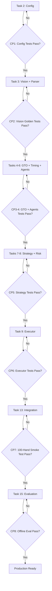

# Critical Testing Checkpoints for Poker Bot Development

Based on your implementation plan, here are the **mandatory stop-and-test gates** before proceeding. These checkpoints prevent cascading failures and ensure you're building on a solid foundation.

---

## 🔴 CHECKPOINT 1: After Task 2 (Configuration Manager)
**Stop and Test Before Task 3**

### What to Validate
```bash
# Test suite to run
npm test -- config.test.ts
```

**Acceptance Criteria:**
- ✅ Load valid configuration without errors
- ✅ Hot-reload detects file changes within 1 second
- ✅ Invalid config triggers rollback (test with missing required fields)
- ✅ Schema validation catches type errors
- ✅ Subscription system notifies components on config changes

**Manual Verification:**
1. Start system with valid config → should load
2. Edit config file with invalid JSON → should rollback with clear error message
3. Change `strategy.alphaGTO` → verify Strategy Engine receives update notification

**Why This Matters:** Config drives all components. If config fails, everything downstream breaks.

---

## 🔴 CHECKPOINT 2: After Task 3 (Vision System + Parser) 
**Stop and Test Before Task 4** ⚠️ **MOST CRITICAL CHECKPOINT**

### What to Validate

```bash
# Run golden test suite
npm test -- vision.golden.test.ts

# Run parser tests
npm test -- parser.test.ts

# Run SafeAction tests
npm test -- safeaction.test.ts
```

**Acceptance Criteria:**
- ✅ **Card recognition: ≥99.5% accuracy** on golden image set (10k+ images)
- ✅ **Latency: ≤50ms @ P95** for frame capture + extraction
- ✅ **Pot/stack error: ≤1 BB @ P95**
- ✅ **Position assignment: ≤0.1% error rate** over 1000 test hands
- ✅ **Confidence gating:** Frames with confidence <0.995 trigger SafeAction
- ✅ **Occlusion detection:** >5% occlusion triggers SafeAction
- ✅ **SafeAction policy:** Returns check-or-fold correctly for all game states

**Manual Verification:**
1. Run vision system on 5-10 different poker platform screenshots
2. Compare extracted values to ground truth
3. Occlude 10% of a card ROI → should trigger SafeAction
4. Check latency distribution: `P50: __ms, P95: __ms, P99: __ms`

**Performance Benchmark:**
```typescript
// Run this benchmark
const results = await benchmarkVision(1000 frames);
console.log(`P50: ${results.p50}ms`);
console.log(`P95: ${results.p95}ms`); // MUST be ≤50ms
console.log(`Accuracy: ${results.accuracy}%`); // MUST be ≥99.5%
```

**Why This Matters:** Vision is the foundation. If you can't extract game state accurately, everything else is garbage-in-garbage-out. This is where 80% of bugs will originate.

---

## 🟡 CHECKPOINT 3: After Task 4 (GTO Solver)
**Stop and Test Before Task 5**

### What to Validate

```bash
npm test -- gto.test.ts
npm run benchmark:gto
```

**Acceptance Criteria:**
- ✅ **Cache hit rate: ≥80%** for preflop situations
- ✅ **Subgame solve latency: ≤400ms** for uncached situations
- ✅ **Output validity:** Action frequencies sum to 1.0, EVs are reasonable
- ✅ **Deep-stack handling:** Different action abstractions applied when stack >100bb
- ✅ **Budget enforcement:** Returns cached policy when time budget would be exceeded

**Manual Verification:**
```typescript
// Test known equilibrium
const state = createTestState('preflop', 'BTN', 100bb);
const solution = await gtoSolver.solve(state, 400);

// Verify output structure
assert(solution.actions.size > 0);
assert(solution.computeTime <= 400);
assert(solution.source === 'cache' || solution.source === 'subgame');

// Check frequencies sum to 1.0
const totalFreq = Array.from(solution.actions.values())
  .reduce((sum, a) => sum + a.frequency, 0);
assert(Math.abs(totalFreq - 1.0) < 0.001);
```

**Performance Test:**
- Run 100 preflop solves → measure cache hit rate
- Run 50 flop subgame solves → measure P95 latency (should be ≤400ms)

**Why This Matters:** GTO solver provides the mathematical foundation for decisions. Bugs here lead to -EV play.

---

## 🟡 CHECKPOINT 4: After Task 6 (Time Budget Tracker) + Task 5 (Agents)
**Stop and Test Before Task 8**

### What to Validate

```bash
npm test -- budget.test.ts
npm test -- agents.test.ts
npm test -- agent-schema.test.ts
```

**Acceptance Criteria - Time Budget:**
- ✅ **Budget tracking accurate** within 5ms
- ✅ **Preemption logic works:** Components honor shouldPreempt() checks
- ✅ **Dynamic adjustment:** Downstream budgets reduced when perception overruns

**Acceptance Criteria - Agents:**
- ✅ **Parallel execution:** All 3 agents queried simultaneously
- ✅ **Timeout enforcement:** Agents that don't respond in 3s are excluded
- ✅ **Schema validation:** Malformed JSON is discarded and counted toward timeout
- ✅ **Circuit breaker:** Trips after N consecutive failures, forces α=1.0
- ✅ **Cost tracking:** Token usage logged per hand

**Integration Test - End-to-End Timing:**
```typescript
// CRITICAL: Test if 2s deadline is achievable
const testCases = generateRandomGameStates(100);
const timings = [];

for (const state of testCases) {
  const start = performance.now();
  
  // Run full decision pipeline (mock execution)
  await visionSystem.capture();
  await parser.parse();
  await Promise.all([
    gtoSolver.solve(state, 400),
    agentCoordinator.queryAgents(state, 1200)
  ]);
  
  const elapsed = performance.now() - start;
  timings.push(elapsed);
}

const p95 = calculatePercentile(timings, 95);
console.log(`P95 latency: ${p95}ms`); // MUST be ≤2000ms
assert(p95 <= 2000, 'Failed to meet 2s deadline at P95');
```

**Why This Matters:** This tests if your latency budget is realistic. If you can't hit 2s @ P95 now, you won't hit it in production.

---

## 🟢 CHECKPOINT 5: After Task 8 (Strategy Engine) + Task 7 (Risk Guard)
**Stop and Test Before Task 9**

### What to Validate

```bash
npm test -- strategy.test.ts
npm test -- risk-guard.test.ts
```

**Acceptance Criteria:**
- ✅ **Blending formula correct:** α × GTO + (1-α) × Exploit produces valid distributions
- ✅ **Action selection:** Samples correctly from distribution using seeded RNG
- ✅ **Bet sizing quantization:** Maps continuous to discrete set correctly
- ✅ **Divergence detection:** Logs when GTO/agent recommendations differ >30pp
- ✅ **Risk limits enforced:** Bankroll/session limits trigger panic stop
- ✅ **Fallback logic:** Returns SafeAction when risk exceeded or agents timeout

**Integration Test - Decision Quality:**
```typescript
// Test deterministic replay
const state = createTestState('flop', 'BTN', 50bb);
const seed = 12345;

const decision1 = await strategyEngine.decide(state, gto, agents, config, riskGuard, seed);
const decision2 = await strategyEngine.decide(state, gto, agents, config, riskGuard, seed);

// Should produce identical decisions
assert.deepEqual(decision1.action, decision2.action);
assert.equal(decision1.reasoning.alpha, decision2.reasoning.alpha);
```

**Why This Matters:** Strategy Engine is the brain. Bugs here mean you make wrong decisions even with perfect inputs.

---

## 🔴 CHECKPOINT 6: After Task 9 (Action Executor)
**Stop and Test Before Task 13** ⚠️ **CRITICAL FOR SAFETY**

### What to Validate

```bash
npm test -- executor.test.ts
npm test -- window-manager.test.ts
```

**Acceptance Criteria:**
- ✅ **Simulator mode works:** Direct API calls execute correctly
- ✅ **Compliance enforcement:** Research UI refuses execution on non-allowlisted sites
- ✅ **Window detection:** Finds poker windows with >99% accuracy
- ✅ **Button detection:** Locates action buttons with >99% accuracy
- ✅ **Coordinate conversion:** ROI → screen coordinates accurate within 5px
- ✅ **Action verification:** Detects mismatches between expected/actual post-action state
- ✅ **Retry logic:** Re-evaluates once on mismatch, then halts

**Manual Verification (Research UI Mode):**
1. Start poker simulator in window
2. Run executor with valid allowlist → should detect window and execute
3. Run executor with non-allowlisted site → **should refuse and halt immediately**
4. Manually close poker window mid-execution → should detect failure and halt

**Why This Matters:** This is where the bot interacts with the real world. Bugs here can cause compliance violations or lost money.

---

## 🔴 CHECKPOINT 7: After Task 13 (Main Pipeline Integration)
**Stop and Test Before Task 15** ⚠️ **END-TO-END VALIDATION**

### What to Validate

```bash
# Run full integration test suite
npm test -- integration.test.ts

# Run 100-hand smoke test
npm run smoke-test:100hands
```

**Acceptance Criteria:**
- ✅ **Full pipeline executes:** Vision → Parser → GTO + Agents → Strategy → Executor → Logger
- ✅ **2s deadline met @ P95** across 100+ test hands
- ✅ **Compliance validation:** Startup checks refuse unauthorized environments
- ✅ **Error handling works:** Components fail gracefully, fallback policies triggered
- ✅ **Safe mode works:** Panic stop locks executor when triggered
- ✅ **Logging complete:** HandRecord contains all required fields (state, solver, agents, decision, timings, seeds, hashes)

**Smoke Test - 100 Hands:**
```bash
# Run against mock simulator
npm run smoke-test:100hands -- --config configs/test.json

# Verify output
- ✅ 100 hands completed without crashes
- ✅ P95 latency ≤ 2000ms
- ✅ All decisions logged with complete metadata
- ✅ No SafeAction triggers (vision confidence should be high in simulator)
- ✅ Win rate is non-negative (basic sanity check)
```

**Performance Validation:**
```typescript
// Check latency distribution for all components
const metrics = await sessionMetrics.get('smoke-test-100');

console.log('Vision P95:', metrics.perModuleLatency.get('vision').p95); // ≤50ms
console.log('GTO P95:', metrics.perModuleLatency.get('gto').p95);       // ≤400ms
console.log('Agents P95:', metrics.perModuleLatency.get('agents').p95); // ≤1200ms
console.log('Total P95:', metrics.latencyDistribution.p95);             // ≤2000ms
```

**Why This Matters:** This proves all components work together. If this passes, you have a working bot.

---

## 🟢 CHECKPOINT 8: After Task 15 (Evaluation Framework)
**Final Validation Before Production**

### What to Validate

```bash
# Run offline evaluation smoke test (minimum)
npm run eval:offline-smoke -- --hands 10000

# Optional: Full 10M hand evaluation
npm run eval:offline-full -- --hands 10000000
```

**Acceptance Criteria (Smoke Test Minimum):**
- ✅ **Win rate ≥3bb/100** vs static opponent (tight-aggressive or loose-passive)
- ✅ **95% confidence interval** does not cross 0
- ✅ **No crashes** during extended run
- ✅ **Memory stable:** No leaks over 10k+ hands

**Acceptance Criteria (Full Evaluation - Optional):**
- ✅ **Win rate ≥3bb/100** vs static pool (10M hands)
- ✅ **Win rate ≥0bb/100** vs mixed GTO benchmark (10M hands)
- ✅ **Exploitability ε ≤ 0.02** vs baseline CFR bot

**Why This Matters:** This validates the bot actually plays well, not just that it doesn't crash.

---

## Testing Checkpoint Summary

| Checkpoint | After Task | Type | Time to Test | Failure Impact |
|-----------|-----------|------|--------------|----------------|
| 1️⃣ Config | Task 2 | Unit | 10 min | 🟡 Medium - blocks all components |
| 2️⃣ Vision | Task 3 | Integration | **2-4 hours** | 🔴 **CRITICAL** - foundation of system |
| 3️⃣ GTO | Task 4 | Integration | 1 hour | 🟡 Medium - decisions will be bad |
| 4️⃣ Timing + Agents | Tasks 5-6 | Integration | 2 hours | 🟡 Medium - won't meet deadline |
| 5️⃣ Strategy | Tasks 7-8 | Integration | 1 hour | 🟡 Medium - wrong decisions |
| 6️⃣ Executor | Task 9 | Integration | **2 hours** | 🔴 **CRITICAL** - compliance & safety |
| 7️⃣ Full Pipeline | Task 13 | E2E | **3-4 hours** | 🔴 **CRITICAL** - proves it works |
| 8️⃣ Evaluation | Task 15 | Performance | 8+ hours | 🟢 Low - validates quality |

---

## Recommended Testing Workflow



---

## Key Takeaways

1. **Don't skip Checkpoint 2 (Vision)** - this is where 80% of bugs will come from
2. **Don't skip Checkpoint 7 (Full Pipeline)** - this proves everything works together
3. **Checkpoint 6 (Executor)** is critical for compliance - test thoroughly
4. **Budget 20-30 hours total** for all testing checkpoints
5. **Use CI to enforce gates** - fail build if checkpoints don't pass

---

## Quick Reference: Critical Tests Per Task

### Task 2 (Config Manager)
- [ ] `config.test.ts` - Load, validate, hot-reload
- [ ] Manual test: Edit config → verify rollback on invalid

### Task 3 (Vision + Parser)
- [ ] `vision.golden.test.ts` - 10k image accuracy test (**≥99.5%**)
- [ ] `parser.test.ts` - Position assignment, state-sync
- [ ] `safeaction.test.ts` - Check-or-fold policy
- [ ] Performance: P95 latency **≤50ms**

### Task 4 (GTO Solver)
- [ ] `gto.test.ts` - Cache hits, subgame solve
- [ ] Benchmark: P95 **≤400ms**

### Tasks 5-6 (Agents + Budget)
- [ ] `agents.test.ts` - Parallel execution, timeout
- [ ] `agent-schema.test.ts` - JSON validation
- [ ] `budget.test.ts` - Tracking, preemption
- [ ] Integration: End-to-end **≤2000ms @ P95**

### Tasks 7-8 (Strategy + Risk)
- [ ] `strategy.test.ts` - Blending, bet sizing
- [ ] `risk-guard.test.ts` - Limits, panic stop
- [ ] Deterministic replay test

### Task 9 (Executor)
- [ ] `executor.test.ts` - Simulator/API/UI modes
- [ ] `window-manager.test.ts` - Detection, coords
- [ ] Compliance: Refuse non-allowlisted sites

### Task 13 (Integration)
- [ ] `integration.test.ts` - Full pipeline
- [ ] 100-hand smoke test

### Task 15 (Evaluation)
- [ ] Offline eval: **≥3bb/100** vs static (10k+ hands)
- [ ] Memory leak check

---

## CI Pipeline Requirements

```yaml
# .github/workflows/test.yml
name: Poker Bot Testing Gates

on: [push, pull_request]

jobs:
  checkpoint-tests:
    runs-on: ubuntu-latest
    steps:
      - name: Checkpoint 1 - Config
        run: npm test -- config.test.ts
        
      - name: Checkpoint 2 - Vision Golden
        run: |
          npm test -- vision.golden.test.ts
          npm test -- parser.test.ts
          npm test -- safeaction.test.ts
        
      - name: Vision Performance Check
        run: |
          npm run benchmark:vision
          # Fail if P95 > 50ms
        
      - name: Checkpoint 3 - GTO
        run: npm test -- gto.test.ts
        
      - name: Checkpoint 4 - Agents + Budget
        run: |
          npm test -- agents.test.ts
          npm test -- agent-schema.test.ts
          npm test -- budget.test.ts
        
      - name: Checkpoint 5 - Strategy + Risk
        run: |
          npm test -- strategy.test.ts
          npm test -- risk-guard.test.ts
        
      - name: Checkpoint 6 - Executor
        run: |
          npm test -- executor.test.ts
          npm test -- window-manager.test.ts
        
      - name: Checkpoint 7 - Integration
        run: |
          npm test -- integration.test.ts
          npm run smoke-test:100hands
        
      - name: Fail if P95 exceeds 2000ms
        run: npm run validate:latency
```

---

**Document Version:** 1.0  
**Last Updated:** Based on tasks.md and requirements.md  
**Status:** Ready for implementation

